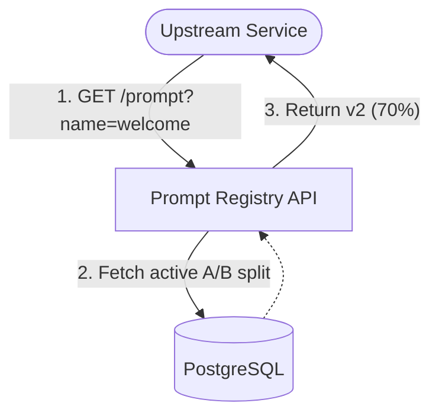

# Architecture — prompt-versioning-ab-testing
> Last updated: 2026-08-29 | Maturity: Partial Prototype
> _Prompt registry and A/B router._

## System Diagram

## Component Table
| Component | File | Responsibility | Tech |
|---|---|---|---|
| Client UI | `client/` | Admin dashboard | React |
| Server | `server/` | A/B router logic | Node.js |
| Database | `docker-compose.yml` | Stores versions | PostgreSQL |

## Dependency Honesty Table
| Dependency | Status | Notes |
|---|---|---|
| PostgreSQL | **Real** | Migrated from MongoDB/SQLite for transactional integrity. |
