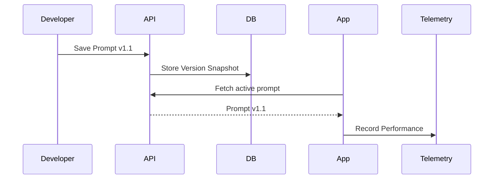

# prompt-versioning-ab-testing Architecture

## System Diagram
The following Mermaid.js sequence diagram maps the core workflow and interactions within the system:

## Component Breakdown
- **Core Technology**: Node.js, MongoDB
- **Design Paradigm**: Emphasizes high availability, fault tolerance, and security boundaries.

## Security & Scaling Considerations
- Strict input validations and sanitization.
- Horizontal scalability achieved via stateless workers and queues where applicable.
- Encrypted data at rest and in transit.
